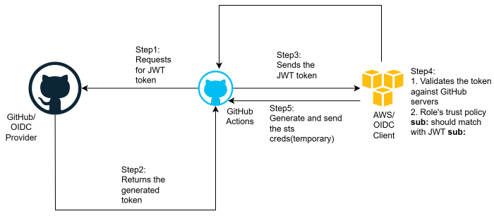

# AWS Multi Environment CI/CD pipeline for Static Web Hosting

---

## Description

[AWS Multi Environment CI/CD pipeline for Static Web Hosting](https://github.com/AdithyaBhatGS/multi-environment-cicd-pipeline-for-static-web-app) is the simple project to demonstrate multi environment CI/CD pipeline setup to automate the deployment of web application with OIDC based authentication. Infrastructure have been automated using CloudFormation.

---

## Key Features

1. Configured multi environment pipeline(dev, prod)
2. Implemented OIDC based authentication for deployment
3. Automated the infrastructure using CloudFormation
   - Contains cross stack references to manage shared infrastructure components
     1. [storage stack](https://github.com/AdithyaBhatGS/multi-environment-cicd-pipeline-for-static-web-app/tree/dev/infra/storage)
        - Buckets for holding static assets
     2. [security stack](https://github.com/AdithyaBhatGS/multi-environment-cicd-pipeline-for-static-web-app/tree/dev/infra/security)
        - IAM Role, IAM Policies, Log grops, Instance Profile, EBS Key
     3. [network stack](https://github.com/AdithyaBhatGS/multi-environment-cicd-pipeline-for-static-web-app/tree/dev/infra/network)
        - VPC, Subnets,Internet Gateway, NAT Gateway, EIP, Route Tables, Security Groups
     4. [application stack](https://github.com/AdithyaBhatGS/multi-environment-cicd-pipeline-for-static-web-app/tree/dev/infra/application)
        - EC2, Launch template, ALB
4. Validation of infrastructure includes
   - yamllint
   - cfn-lint
   - cloudformation validate-template
5. Logging using CloudWatch

---

## Architecture Diagrams

### Architecture Deep Dives

<details>
<summary><b>Authentication Flow Diagram</b></summary>



</details>

<details>
<summary><b>IAM Policies Flow</b></summary>


</details>

<details>
<summary><b>CI/CD Pipeline Flow</b></summary>


</details>

## Project Organization

1. [.github/workflows](https://github.com/AdithyaBhatGS/multi-environment-cicd-pipeline-for-static-web-app/tree/dev/.github/workflows)
   - Contains the workflow files for validation, infra deployment, app deployment
2. [.app/src](https://github.com/AdithyaBhatGS/multi-environment-cicd-pipeline-for-static-web-app/tree/dev/app/src)
   - Contains the application related code
3. [.infra](https://github.com/AdithyaBhatGS/multi-environment-cicd-pipeline-for-static-web-app/tree/dev/infra)
   - Contains the infrastructure related code
4. [.yamllint.yaml](https://github.com/AdithyaBhatGS/multi-environment-cicd-pipeline-for-static-web-app/blob/dev/.yamllint.yaml)
   - Contains yamllint related configurations
5. [.requirements.txt](https://github.com/AdithyaBhatGS/multi-environment-cicd-pipeline-for-static-web-app/blob/dev/requirements.txt)
   - Contains the required dependendencies for infrastructure deployments

## Usage

### For manual deployments(without Actions):

1. Linting using YAML
   - ```
     yamllint TEMPLATE_FILE
     ```
2. Linting using cfn-lint
   - ```
     cfn-lint TEMPLATE_FILE
     ```
3. Validating the template using cloudformation validate-template
   - ```
     aws cloudformation validate-template --template-body file://$TEMPLATE_FILE
     ```
4. Deployment order
   - storage stack > security stack > network stack > application stack
5. Deploying the template
   - ```
     aws cloudformation deploy \
       --stack-name "STACK_NAME" \
       --template-file "TEMPLATE_FILE" \
       --parameter-overrides file://"PARAMS_FILE" \
       --capabilities CAPABILITY_NAMED_IAM \
       --region "AWS_REGION" \
       --debug
     ```

### For automated deployments(using Actions):

1. Configure required IAM Roles with policies in AWS for OIDC
2. Pipelines and thier usage
   1. [validate-infra-on-pr.yaml](https://github.com/AdithyaBhatGS/multi-environment-cicd-pipeline-for-static-web-app/blob/dev/.github/workflows/validate-infra-on-pr.yaml)
      - Validates the cloudformation code for YAML, CloudFormation syntactical errors
   2. [deploy-infra.yaml](https://github.com/AdithyaBhatGS/multi-environment-cicd-pipeline-for-static-web-app/blob/dev/.github/workflows/deploy-infra.yaml)
      - Deployes the infrastructure for every change on [infra/](https://github.com/AdithyaBhatGS/multi-environment-cicd-pipeline-for-static-web-app/tree/dev/infra) on push to dev/prod
   3. [deploy-app.yaml](https://github.com/AdithyaBhatGS/multi-environment-cicd-pipeline-for-static-web-app/blob/dev/.github/workflows/deploy-app.yaml)
      - Deploys the application code from s3 to EC2 for every change to [app/](https://github.com/AdithyaBhatGS/multi-environment-cicd-pipeline-for-static-web-app/tree/dev/app/src) on push to dev/prod

---
